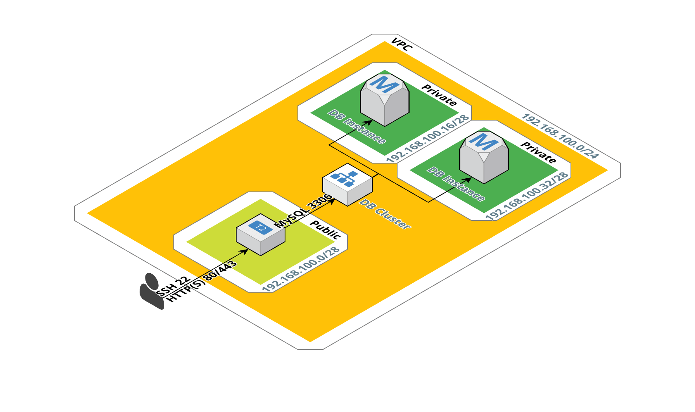

# RDS-cloudformation

## CloudFormation template for AuroraDB

Here's a CloudFormation template to set up Multi-AZ Aurora in private subnets, along with a public EC2 web server or bastion. 

[CloudFormation template](https://raw.githubusercontent.com/ThornTechPublic/RDS-cloudformation/master/RDS-template.json)

Just use admin as the master username:

`mysql -h abcdefg.hijklmnop.us-east-1.rds.amazonaws.com -P 3306 -u admin -p`

**Tip**: You can get the EC2 elastic IP and DB cluster endpoint from the CloudFormation outputs tab. And here's a diagram of what this provisions:

**Note**: Multi-AZ is two for twice the price, so be sure to spin this back down if you're not using it

For repo maintainers: don't modify the CloudFormation template directly. Instead, edit the `tropo.py` file, and generate a new template using `generate_json.sh`.